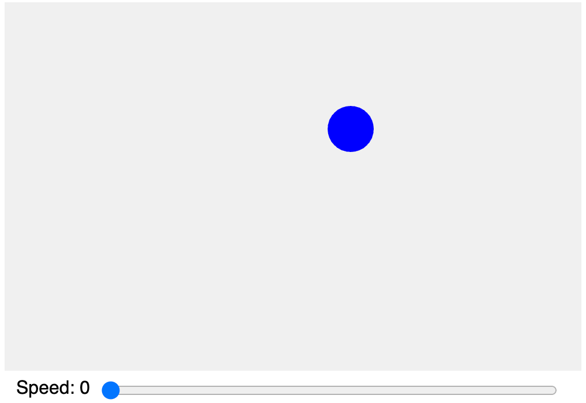

# Bouncing Ball

<!-- 

<meta property="og:image" content="./bouncing-ball.png" />

The figure markup is causing the image to not render in this version.

<figure markdown>
    { width="400" }
    <figcaption>A bouncing ball is our "Hello World!".</figcaption>
</figure>
-->

<figure markdown>
   { width="400" }
    <figcaption>A bouncing ball is our "Hello World!".</figcaption>
</figure>

[Link to Bouncing Ball Demo](./bouncing-ball.html){ .md-button .md-button--primary }

The bouncing ball is the "Hello World!" of the Processing system.
It contains the key element that shows the power of the Processing system:
graphics with movement.  In the area of MicroSims, we also
want clearly visible user interface elements that can control
the running of our simulations.  This version contains a 
slider to control the speed of the ball's movement.


## Prompt

Here is a simple prompt to get you started.

```linenums="0"
Generate a single p5.js sketch of a blue bouncing ball on a 500x300 canvas.
```

Copy the prompt into ChatGPT.  It will generate a JavaScript file you can copy and paste or download
into the p5.js editor to test.

Here is a more precise prompt that also allows us to change the speed using a slider.

```linenums="0"
The sketch shows a ball bouncing around a rectangular area.
The canvas should be 500 wide and 300 high.
The default text size is 16.
The ball is blue and has a radius of 20.
There is a slider that changes the speed from 0 to 20 with a default speed of 3.
The slider should be placed at the bottom of the canvas.
The slider should have a label "Speed: " and the speed value to the left of the slider.
The slider should span the width of the canvas after the label and value.
DD NOT use objects - just functions.
```

Here is an additional example that allows the user to change both the speed and the ball size:


## Sample Source Code

Here is some sample source code that has been generated and modified just a little for readability.

```js
// bouncing ball - version 1
// designed for use using touch sensitive whiteboard in a classroom

let width = 500;
let height = 350;
let drHieght = 320; // region for drawing
r = 20; // radius of the ball

// initial position
x = 100;
y = 100;
speed = 3; // default speed
// direction of motion
dx = speed;
dy = speed;
sliderLeftMargin = 83;

function setup() {
  const canvas = createCanvas(width, height);
  // Include this for placement in our HTML page but not in the editor
  // canvas.parent('canvas-container');

  // make the text a bit larger for large classrooms
  textSize(16);

  speedSlider = createSlider(0, 20, speed);
  speedSlider.position(sliderLeftMargin, height - 25);
  speedSlider.style('width', width - sliderLeftMargin - 15 + 'px');
}

function draw() {
  background(240); // light gray

  speed = speedSlider.value()
  
  if (dx > 0) dx = speed;
     else dx = -speed;
  
  if (dy > 0) dy = speed;
     else dy = -speed;
  
  // Add the current speed to the position.
  x += dx;
  y += dy;

  if ((x > width) || (x < 0)) {
    dx = dx * -1;
  }
  if ((y > drHieght) || (y < 0)) {
    dy = dy * -1;
  }

  fill('blue');
  circle(x, y, r*2);
  fill('black');
  text('Speed: ' + speed, 10, height-10)
}
```

## Key Points about the Code

1. We created some global variables before the setup() function
2. We created a setup() function to initialize the canvas and the slider
3. We created a draw() function to render check that moves the ball, checks the edges, and draws the circle and text.

## Use In Classroom

1. **Physics Lesson:** Use this simulation to discuss concepts like velocity, acceleration, and kinetic energy. Ask students to predict how changing the speed will affect the ball's movement.
2. **Math Integration:** Introduce concepts of geometry and algebra, such as calculating the ball's trajectory or the distance traveled over time.
3. **Coding Concepts:** Use this as a base for teaching basic programming concepts, such as variables, functions, and object-oriented programming. Students can modify the code to change the ball's size, color, or even add more balls.

## Lesson Plan for a 9th-Grade Physical Science Class

### Objective
Students will understand the concepts of kinetic and potential energy, and how these energies are transformed during the motion of a bouncing ball.

### Materials
- Computer with internet access for the p5.js editor.
- The bouncing ball simulation (as provided in the previous response).
- Whiteboard or chalkboard.
- Writing materials for students.

### Lesson Plan

#### Introduction (10 minutes)
- Begin with a brief discussion on energy: what it is and its different forms, focusing on kinetic and potential energy.
- Introduce the concept of energy transformation, particularly how potential energy is converted to kinetic energy and vice versa.

#### Demonstration (15 minutes)
- Display the bouncing ball simulation to the class.
- Show how the ball’s speed (kinetic energy) increases as it falls (due to potential energy converting to kinetic energy) and decreases as it rises (kinetic converting back to potential).

#### Interactive Activity (20 minutes)
- Have the students access the simulation on their computers.
- Ask them to experiment with different speeds and observe the ball’s behavior.
- Prompt questions for exploration: 
  - How does changing the speed affect the ball’s motion?
  - Can they identify when the ball has the most kinetic or potential energy?

#### Group Discussion (15 minutes)
- Bring the class back together to discuss their observations.
- Facilitate a conversation about how the simulation demonstrates the concepts of kinetic and potential energy.
- Discuss real-world examples, like a roller coaster or a skateboarder in a halfpipe.

#### Concept Application (20 minutes)
- Provide a worksheet with problems related to kinetic and potential energy.
- Include problems where students calculate the potential energy at the ball’s highest point and the kinetic energy at different points of the motion.
- Students can use the simulation to visually understand the problems.

#### Wrap-Up and Reflection (10 minutes)
- Summarize the key concepts learned in the lesson.
- Ask students to write a short paragraph on how the simulation helped them understand the energy transformation.

#### Homework
- Assign a project where students create their own simulation or modify the existing one to demonstrate a different physics concept.

### Assessment
- Participation in the interactive activity and group discussion.
- Accuracy and understanding shown in the worksheet.
- Reflection paragraph and homework project.

