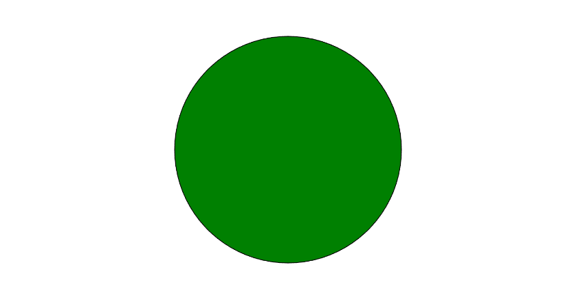

# Mkdocs Material Social Image Override Test

<meta property="og:image" content="/green-circle.png">

This is a green circle on a rectangle with a 1.91 to 1 width-to-height ratio
as suggested by the Open Graph Image guideline.

* [Discussion](https://github.com/squidfunk/mkdocs-material/discussions/5162)