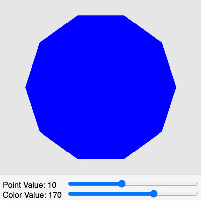

# Polygon

<figure markdown>
{ width="400" }
<figcaption>A multi-sided polygon.</figcaption>
</figure>

[Polygon Demonstration](./polygon.html){ .md-button .md-button--primary }

In this example, we will use a more detailed prompt to control the placement of the sliders and their values.

## Prompt

```linenums="0"
Generate a p5.js sketch file that draws filled polygons on a 400x400 canvas.

Create one range control slider that allows the number of points on
the polygon to vary from 3 to 10 in steps of 1.  Make the default be 10.

Create a second range control slider that allows the color inside the polygon
to be changed to any color.  Make the default value be 170 (blue).

Make the sliders be the width of the canvas less the width of the
labels and values.  Place the sliders at the bottom
of the canvas 100 points in from the left.

Use the text() function at the end of the draw() function to display the
name and current values of the sliders in the bottom left of the screen.
```

## Sample Response

This sample code has been manually edited to improve the placement and formatting of the controls.

```js
// A MicroSim of drawing a polygon.  Sliders controls the number of edges and the color.
let canvasSize = 400;
let polygonRadius = 150
let colorSlider;
let pointSlider;
let drawHeight = 350;
let sliderLeftMargin = 140;

function setup() { 
    const canvas = createCanvas(canvasSize, canvasSize);
    canvas.parent('canvas-container');
    textSize(16);
    noStroke();
    strokeWeight(0);
    // Change the default color scheme from RGB to Hue, Saturation and Brightness
    colorMode(HSB, 255);

    // number of points (or edges) in polygon
    pointSlider = createSlider(3, 20, 10);
    pointSlider.position(sliderLeftMargin, canvasSize - 35);
    pointSlider.style('width', width - sliderLeftMargin + 'px')

    colorSlider = createSlider(0, 255, 170);
    colorSlider.position(sliderLeftMargin, canvasSize - 15);
    colorSlider.style('width', width - sliderLeftMargin + 'px')
}

function draw() {
    fill(230);
    rect(0, 0, width, drawHeight);
    fill(245);
    rect(0, drawHeight, width, canvasSize-drawHeight);
    let colorValue = colorSlider.value();
    let pointValue = pointSlider.value();

    // Draw the polygon, HSB
    fill(colorValue, 255, 255);
    beginShape();
    for (let i = 0; i < pointValue; i++) {
        // walk around the 360 angles
        let angle = map(i, 0, pointValue, 0, TWO_PI);
        let x = canvasSize/2 + polygonRadius * cos(angle);
        let y = drawHeight/2 + polygonRadius * sin(angle);
        vertex(x, y);
    }
    endShape(CLOSE);

    // Draw the slider values
    fill('black');
    noStroke(); 
    strokeWeight(0);
    text("Point Value: " + pointValue, 5, canvasSize - 25);
    text("Color Value: " + colorValue, 5, canvasSize - 5);  
}

```

## Lesson Plan

### Activities

#### Add Slider

Add a new slider to control the radius of the polygon.
