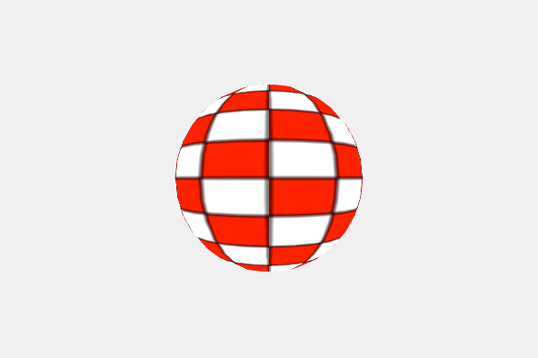

# Bouncing 3D Sphere Demo


<figure markdown>
  { width="400" }
  <figcaption>A 3D sphere rendered using the WebGL.</figcaption>
</figure>

[3D Sphere Demo](sphere.html){ .md-button .md-button--primary }

We can also use the 3D "WebGL" rendering system that is built into p5.js. 
[WebGL](https://en.wikipedia.org/wiki/WebGL), short for Web Graphics Library is
is a JavaScript API for rendering interactive 2D and 3D graphics within any compatible web browser.
The p5.js has many high-level 3D shapes such as box, cone, cylinder, ellipsoid, plane, sphere, and torus 
in the [WEBGL Library](https://p5js.org/reference/#/p5/WEBGL).

## Sample Prompt

```linenums="0"
1. Generate a single file p5.js sketch using WEBGL for a 3D animation.
2. Show a sphere of size 50 that is bouncing around the canvas.
3. Use the ```WEBGL``` as the third parameter of the createCanvas.
4. Cover the sphere with a texture that has grid of white and red squares.
5. Use noStroke() in the texture to not draw the outlines of the grid.
6. Add a drop shadow under the sphere

function setup() {
  createCanvas(600, 400, WEBGL);
```

## Sample Response

```javascript
// A bouncing sphere with a red and white grid texture
let x, y, z;
let xspeed, yspeed, zspeed;
let diameter = 50;
let radius = diameter / 2;
let canvasWidth = 600;
let canvasHeight = 400;

function setup() {
  const canvas = createCanvas(canvasWidth, canvasHeight, WEBGL);
  // comment this out if running in the example
  canvas.parent('canvas-container');
  x = 0;
  y = 0;
  z = 0;
  xspeed = 2;
  yspeed = 2.3;
  zspeed = 1.7;
}
  
function draw() {
  background(240);

  // Update the position of the sphere
  x += xspeed;
  y += yspeed;
  z += zspeed;

  // Check for bouncing
  if (x > width/2 - radius || x < -width/2 + radius) {
    xspeed *= -1;
  }
  if (y > height/2 - radius || y < -height/2 + radius) {
    yspeed *= -1;
  }
  if (z > 200 - radius || z < -200 + radius) {
    zspeed *= -1;
  }

  // Draw the sphere with a texture
  push();
  translate(x, y, z);
  texture(createGridTexture());
  sphere(diameter);
  pop();
}

// create texture pattern of a grid of white and red squares
function createGridTexture() {
  let texSize = 200;
  let texture = createGraphics(texSize, texSize);
  // I had to add this line by
  noStroke();
  for (let i = 0; i < texSize; i += 20) {
    for (let j = 0; j < texSize; j += 20) {
      texture.fill((i + j) % 40 === 0 ? 'white' : 'red');
      texture.rect(i, j, 20, 20);
    }
  }
  return texture;
}
```

### What We Learned

* P5.js has a robust library of 3D animation tools
* We need to specify the WEBGL rendering library when we create the canvas
* Rendering is very fast and smooth if your computer supports the WebGL API standards
* P5.js has a library for generating 3D shapes such as cone, cube and sphere
* You can pass a function to the shape that indicates what pattern (texture) to use on the shape
* P5.js has a function that builds textures
* You just need to generate a 2D pattern to use that texture.

## Extending the Lesson

* Add a drop shadow to the ball
* Place axis lines in the background
* Add a slider to control the speed and size of the sphere

## Sample Lesson Plan

### Objective
- Understand the basics of 3D rendering using p5.js.
- Learn how to manipulate 3D objects and apply textures.
- Develop skills in JavaScript and graphics programming.

### Duration
1 hour

### Materials Needed
- Computers with internet access.
- Code editor (like p5.js Web Editor).
- Projector for demonstrations.

### Lesson Outline

#### 1. Introduction to p5.js and 3D Graphics (15 minutes)
- Brief overview of p5.js and its capabilities.
- Introduction to the concept of 3D graphics.
- Discuss the `WEBGL` renderer in p5.js.

#### 2. Basic 3D Shapes and Transformations (10 minutes)
- Demonstrate how to create basic 3D shapes (e.g., sphere).
- Explain translation and rotation in a 3D space.

### 3. Hands-on Coding: Bouncing Sphere (15 minutes)
- Students will follow along to create a basic 3D sketch with a bouncing sphere.
- Explain the concepts of `setup()` and `draw()` functions.
- Discuss coordinate systems and movement in 3D space.

#### 4. Adding Texture to the Sphere (10 minutes)
- Introduce the concept of textures in 3D.
- Guide students to modify their sketch to apply a grid texture to the sphere.

#### 5. Customization and Experimentation (5 minutes)
- Encourage students to modify the speed, size, and texture of the sphere.
- Discuss how these changes affect the animation.

#### 6. Q&A and Discussion (5 minutes)
- Open the floor for questions.
- Discuss potential applications of what they've learned.

### Assessment
- Observe student engagement and understanding during the hands-on coding session.
- Review the modifications students make to their sketches for creativity and understanding.

## Follow-Up Activities
- Assign a project where students create their own 3D animation using p5.js.
- Encourage students to explore more complex shapes and textures.

## Draw Shadow

```javascript
  // Draw shadow
  drawShadow(ball.x+10, ball.y+30, ballSize);

  function drawShadow(x, y, size) {
  push();
    noStroke();
    fill(50, 50, 50, 100); // Semi-transparent shadow
    ellipse(x, y + size / 4, size * 0.8, size / 8);
  pop();
}
```
## References

- [YouTube Video of the Amiga Boing Ball](https://www.youtube.com/watch?v=-ga41edXw3A)
- [p5.js Reference](https://p5js.org/reference/)
- [p5.js Web Editor](https://editor.p5js.org/)